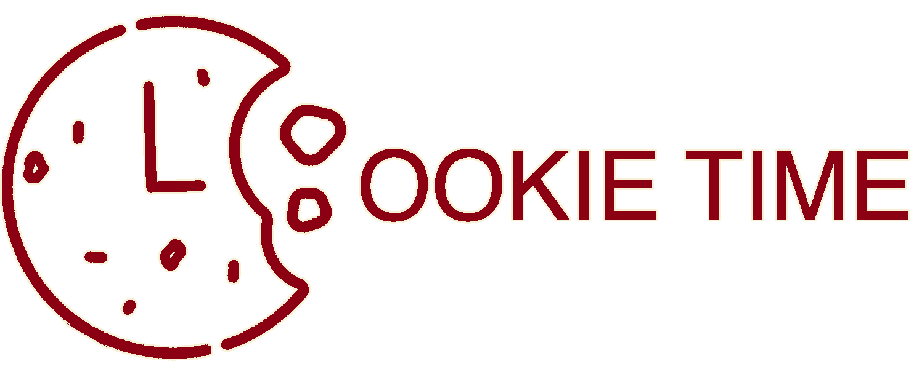
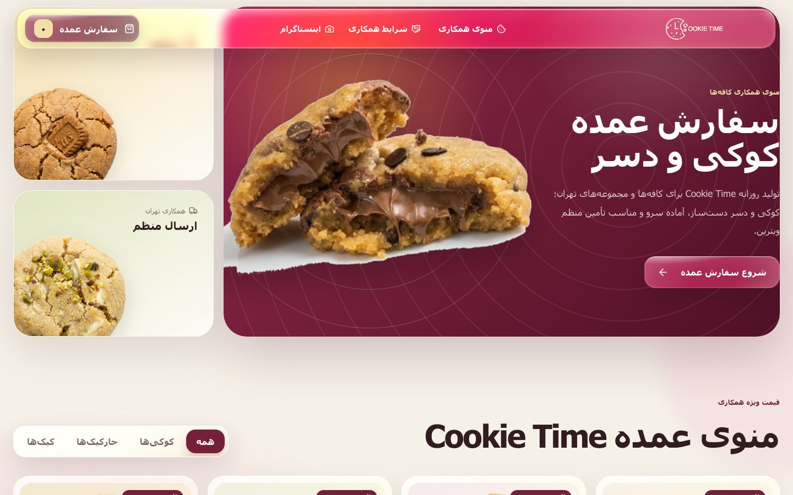
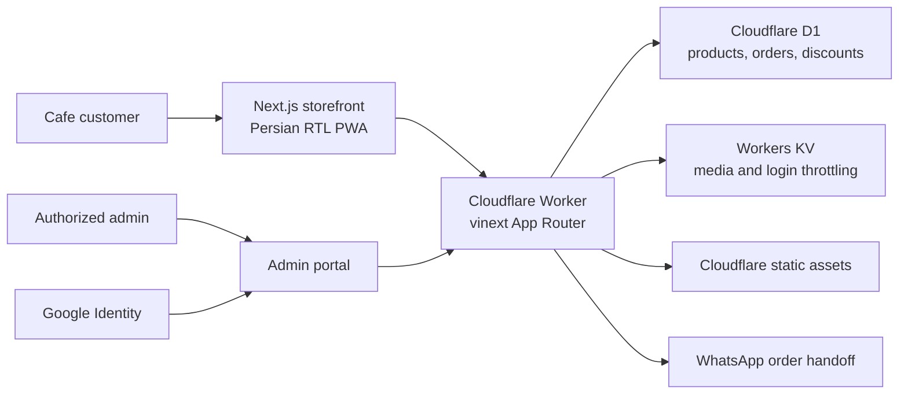
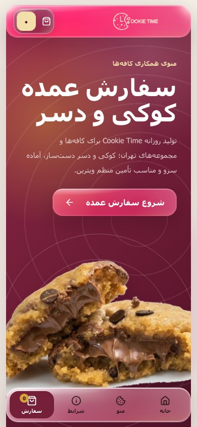
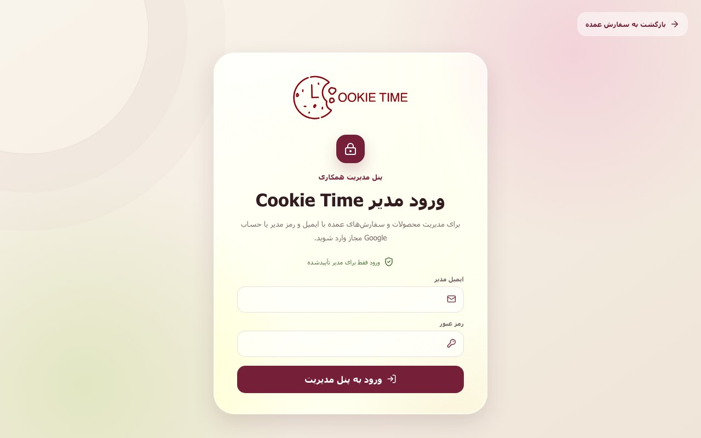

<div align="center">
  

  <h1>Cookie Time Wholesale</h1>

  <p>
    A production Persian wholesale ordering PWA for cafes and hospitality businesses.<br />
    Built edge-first with Next.js, TypeScript, Cloudflare Workers, D1, and Workers KV.
  </p>

  <p>
    <a href="https://github.com/ihoooman/cookie-time-wholesale/actions/workflows/ci.yml"></a>
    <a href="https://seller.time-cookie.com"></a>
    
    
    
  </p>

  <p>
    <a href="https://seller.time-cookie.com"><strong>Live storefront</strong></a>
    ·
    <a href="https://seller.time-cookie.com/admin">Admin portal</a>
    ·
    <a href="CLOUDFLARE.md">Deployment guide</a>
    ·
    <a href="docs/ARCHITECTURE.md">Architecture</a>
  </p>
</div>



## Overview

Cookie Time Wholesale replaces a manual business-ordering flow with a focused,
mobile-first experience. Cafe owners browse the live catalog, build a bulk cart,
apply eligible discounts, submit business details, and continue the finalized
order in WhatsApp. Staff manage the catalog, inventory, discounts, media, and
order history through a protected admin portal.

The customer experience is fully localized for Persian: right-to-left layout,
Persian numerals, toman pricing, local phone validation, and business-specific
wholesale rules.

## What makes it production-ready

| Area | Implementation |
| --- | --- |
| Storefront | Responsive product catalog, category filters, product details, cart, quantity controls, and discount validation |
| Wholesale rules | Minimum order enforcement, per-product volume eligibility, preparation-time notices, and server-calculated totals |
| Order handoff | Durable D1 order record plus a preformatted WhatsApp conversation containing the complete order |
| Admin portal | Product CRUD, image upload, inventory, featured items, discount codes, order history, and sales insights |
| Authentication | Google ID token verification, a single-email allowlist, password fallback, signed sessions, and rate limiting |
| Media | Bundled product photography plus admin uploads stored in Workers KV, with legacy R2 compatibility |
| Discoverability | Server-rendered catalog, product routes, canonical URLs, sitemap, robots policy, Open Graph data, and JSON-LD |
| Experience | Installable PWA, mobile navigation, accessible controls, and browser-tuned Liquid Glass for Safari and Chromium |
| Delivery | GitHub Actions quality gate and automatic Cloudflare Workers deployment from `main` |

## Architecture



See [the architecture document](docs/ARCHITECTURE.md) for request flows,
security boundaries, data ownership, and deployment details.

## Screenshots

| Mobile PWA | Restricted admin sign-in |
| --- | --- |
|  |  |

## Technology

- **Application:** Next.js 16 App Router, React 19, TypeScript 5
- **Edge runtime:** Cloudflare Workers via vinext and Vite
- **Data:** Cloudflare D1 with Drizzle schema and SQL migrations
- **Media and throttling:** Cloudflare Workers KV
- **Authentication:** Google Identity Services, JOSE/JWT, HttpOnly sessions
- **Interface:** Custom responsive CSS, Lucide icons, PWA service worker
- **Quality:** ESLint, strict TypeScript, Node test runner, GitHub Actions

## Local development

### Requirements

- Node.js 22 or newer
- npm 11 or a compatible npm release
- A Cloudflare account only when creating or deploying remote resources

### Setup

```bash
git clone https://github.com/ihoooman/cookie-time-wholesale.git
cd cookie-time-wholesale
npm ci
cp .dev.vars.example .dev.vars
npm run dev
```

The development runtime supplies a local admin session. Google and password
sign-in are enforced in production.

### Environment variables

| Variable | Required in production | Purpose |
| --- | --- | --- |
| `GOOGLE_CLIENT_ID` | Yes for Google sign-in | OAuth Web client ID used to validate Google credentials |
| `AUTH_SECRET` | Yes | Random secret of at least 32 characters used to sign admin sessions |
| `ADMIN_PASSWORD` | Yes for password fallback | Strong password stored only as a Cloudflare secret |

Never commit `.env`, `.env.local`, or `.dev.vars`. Only the documented example
files belong in version control.

## Commands

| Command | Purpose |
| --- | --- |
| `npm run dev` | Start the local vinext/Cloudflare development server |
| `npm run build` | Create the production application and Worker bundles |
| `npm run lint` | Run the Next.js ESLint rules |
| `npm run typecheck` | Generate Cloudflare runtime types and run strict TypeScript checks |
| `npm run audit` | Fail on high or critical production dependency advisories |
| `npm test` | Build and run the rendered-contract test suite |
| `npm run check` | Run the complete local quality gate |
| `npm run db:generate` | Generate Drizzle migrations after schema changes |
| `npm run cf:dry-run` | Validate a Cloudflare deployment without publishing it |

## Cloudflare deployment

Production runs at [seller.time-cookie.com](https://seller.time-cookie.com) and
deploys automatically from `main`. The Worker uses the `DB`, `MEDIA_KV`, and
`ASSETS` bindings defined in `wrangler.jsonc`.

The complete first-time setup, secrets, migration, GitHub integration, and
deployment commands are documented in [CLOUDFLARE.md](CLOUDFLARE.md).

## Repository guide

```text
app/                 Next.js pages, UI, route handlers, and admin portal
db/                  Drizzle schema
drizzle/             Versioned D1 migrations
lib/                 Authentication, data access, domain types, and WhatsApp flow
public/              Brand, product, PWA, and social assets
worker/              Cloudflare Worker entry point and edge response policy
tests/               Build-level product, auth, SEO, and deployment contracts
docs/                Architecture and portfolio screenshots
.github/              CI, ownership, contribution, and issue workflows
```

## Security and contributions

- Read [SECURITY.md](SECURITY.md) before reporting a vulnerability.
- Read [CONTRIBUTING.md](CONTRIBUTING.md) before proposing a change.
- Admin and API routes are excluded from indexing at both application and Worker layers.
- Pricing, inventory, discounts, and order totals are resolved on the server; cart values from the browser are never trusted.

## License

This is a publicly viewable portfolio and production repository, not an
open-source distribution. The source code and Cookie Time brand assets are
provided under the terms in [LICENSE](LICENSE).
