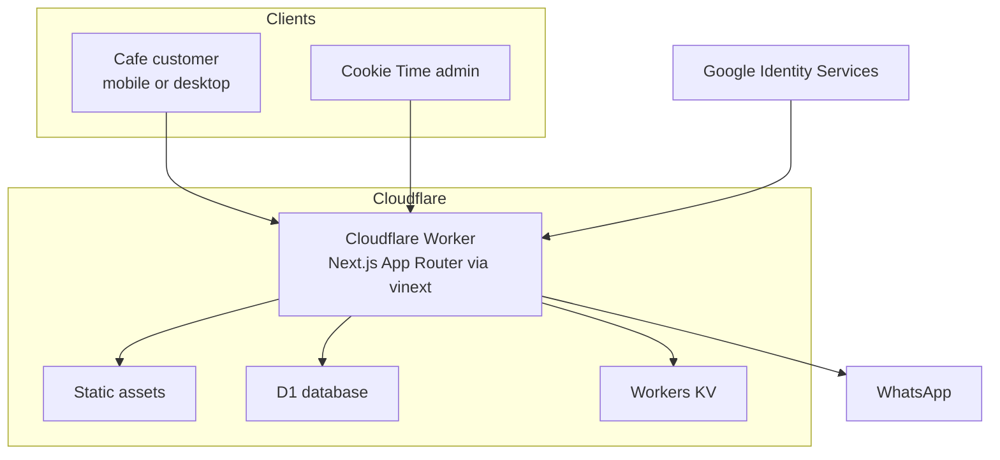
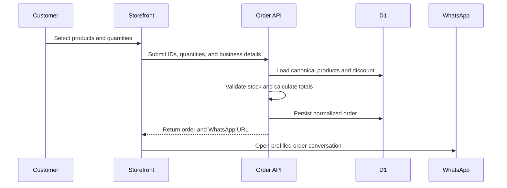
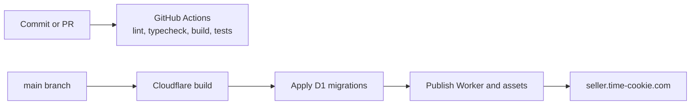

# Architecture

This document explains the production architecture of Cookie Time Wholesale,
the boundaries between customer and administrative flows, and the decisions
that keep the application practical on Cloudflare's edge platform.

## System context

## Application boundaries

### Public storefront

The homepage and product pages are server-rendered for fast first content and
search visibility. The interactive storefront hydrates in the browser to handle
filters, product dialogs, cart state, discount validation, and checkout.

Product prices and stock shown in the UI originate from D1. During checkout,
the browser sends only product IDs and quantities. The server reloads the
canonical products, validates availability and wholesale constraints, and
recalculates every total before persisting the order.

### Order lifecycle

The WhatsApp handoff is deliberately the final confirmation channel. A durable
order is stored first, so the admin still has an order record if the customer
closes WhatsApp before sending the message.

### Admin boundary

`/admin` and `/api/admin/*` require a signed, HttpOnly, SameSite session.
Production authentication supports:

1. Google ID tokens validated against Google's remote JWKS and OAuth audience.
2. A password fallback stored exclusively as a Cloudflare secret.
3. A single normalized email allowlist for both methods.

Failed password attempts are keyed by a hashed client address and stored with a
15-minute TTL in Workers KV. Admin and API responses also receive an edge-level
`X-Robots-Tag` policy.

## Data ownership

| Store | Data | Reason |
| --- | --- | --- |
| D1 | Products, orders, discounts | Relational constraints, ordering, filtering, and durable business records |
| Workers KV | Uploaded media and temporary login-attempt counters | Globally available key/value access and automatic TTL support |
| Static assets | Brand files, seed product imagery, icons, PWA files | Immutable delivery through Cloudflare's asset binding |
| Browser | Ephemeral cart and interaction state | Responsive UX; never used as the authority for pricing |

The schema is maintained in `db/schema.ts`; production migrations are versioned
under `drizzle/` and applied before a direct deployment.

## Runtime and deployment

`vinext` compiles the Next.js App Router application into a Worker-compatible
bundle. `worker/index.ts` wraps the generated handler with edge response policy,
while the Cloudflare Vite plugin provides local bindings and production assets.

The production Worker is connected to the GitHub `main` branch. Cloudflare
secrets remain dashboard-managed, and `keep_vars` prevents deployment commands
from erasing them.

## Browser-specific Liquid Glass

The glass system uses shared materials with engine-specific blur variables.
Safari receives lower blur values because WebKit renders the same filter more
frosted, while Chromium receives stronger values. The production test suite
asserts that both the standard and WebKit-prefixed `backdrop-filter`
declarations survive CSS optimization.

## Operational safeguards

- Strict TypeScript includes generated Cloudflare runtime bindings.
- D1 migrations and bindings are validated before direct deployment.
- CI builds the production bundle before running contract tests.
- API errors are normalized and user-safe.
- Secrets and generated runtime files are excluded from Git.
- Product, order, authentication, SEO, and deployment contracts have automated coverage.
